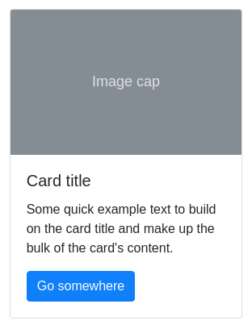

## **`!РЕШЕНО! Композиция компонентов. Все задачи`**  
### Задачи разделены по компонентам в папке components

---

### Ссылкка на [github-pages](https://rt-vinsent.github.io/ra16-hw-5/)

---

---

Композиция компонентов

Необходимо выполнить и предоставить на проверку следующие задачи:

1. Карточки.

## Карточки

Вам необходимо реализовать компонент карточек, позволяющий использовать себя следующим образом:

В качестве CSS вы можете использовать Bootstrap, а подглядеть генерируемую разметку можете на [странице]( https://getbootstrap.com/docs/4.3/components/card/).

Подсказка: используйте для этого `props.children` и `props` для отображения картинки.

2. Декомпозиция.

## Декомпозиция

Вы работаете в стартапе, который решил тягаться с самим Яндексом в части предоставления контента. Это, конечно же, шутка, но задача нешуточная.

Вам принесли дизайн-макет, похожий на этот:

Что вам нужно сделать:

1. Разбейте весь интерфейс на компоненты и в файле каждого компонента напишите буквально одну строку комментария, за что данный компонент отвечает. Можете использовать формат JSDoc, детали про него можно посмотреть по [ссылке](https://react-styleguidist.js.org/docs/documenting/). Также рекомендуем [статью](https://medium.com/@antonkrinitsyn/jsdoc-react-5e6c530880a0) на тему JSDoc.
1. Постарайтесь повторяющиеся компоненты сделать настраемыми за счёт `props`. Допустим, у каждой новости в списке новостей: иконка, текст и ссылка.

Функциональность и стилизацию реализовывать не нужно, достаточно базового оформления, чтобы видно было все блоки.

3. Collapse — необязательная задача.

## Collapse

Вам поручено реализовать аналог компонента [Collapse](https://getbootstrap.com/docs/5.0/components/collapse/#example).

Используйте следующие props:
* `collapsedLabel`,
* `expandedLabel`.

Если значения этих `props` не переданы, то они принимают значения по умолчанию `Развернуть` (для `collapsedLabel`) и `Свернуть` (для `expandedLabel`).

Попробуйте также реализовать анимацию с помощью CSS.

---

 

Все три задачи лучше сдавать в разных репозиториях, то есть через create-react-app реализовать три проекта, чтобы не
было конфликта стилей. Но если вы позаботитесь о том, что конфликта не будет, то можете сдавать и в одном проекте.

Все стили необходимо размещать в файле App.css.

#### Альтернативный способ создания приложения React с использованием тулинга Vite

Приложение также можно создать используя инструмент Vite.
Документация по созданию приложения [React](https://vitejs.dev/guide/).

1. Откройте терминал и пропишите следующую команду: `yarn create vite my-app --template react`,
   либо `yarn create vite my-app --template react-ts`, если
   нужен шаблон с TypeScript. Эта команда создаст настроенный
   шаблонный проект.
2. Откройте созданный проект в своей IDE.
3. Установите зависимости.
4. Готово. Чтобы запустить приложение, введите команду: `yarn dev`(либо `npm run dev`).